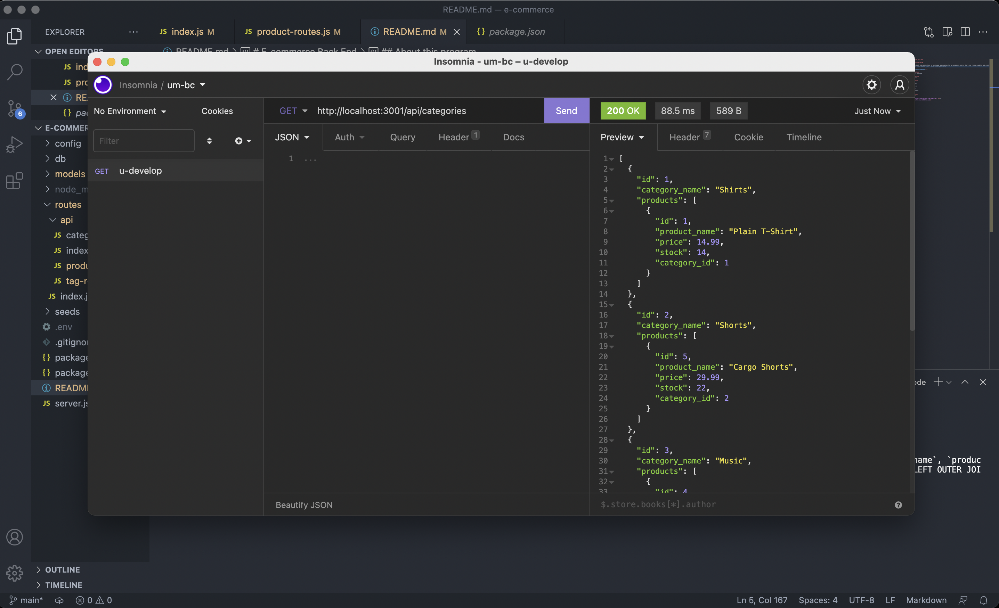

# E-commerce Back End 

## About this program

E-commerce back end application is a storage application for an ecommerce store. Users can review, update, add, and even delete products and its prices, stock quantity, etc...using this application.

## Installation
npm install package

## Contributing
Hector Perez

## Built with

* Javascript
* node.js
* express.js
* mysql
* sequelize
* npm packages

### Questions
Contact me:

[Github](https://www.github.com/hpere102)  
[Email](mailto:hpere102@fiu.edu)